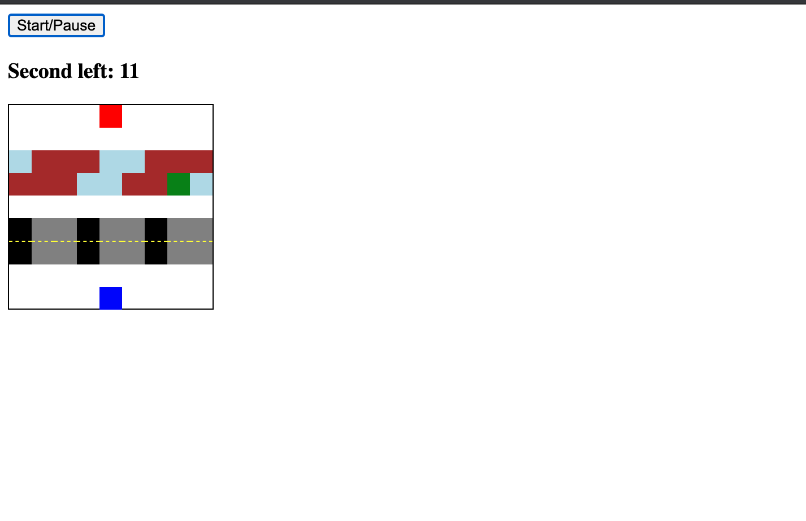

# FROGGER JS

Frogger is a retro grid-based arcade game built in vanilla JavaScript, HTML and CSS.

The object of the game is to direct the frog from the starting point to its home by crossing a busy road and a river by jumping on the passing logs. It is timed and displays to the user when they succeed or lose.

Screenshot of application:

Live link, [here](https://nard1n.github.io/frogger)

## Table of Contents

* [Installation](#Installation)
* [Usage](#Usage)
* [Contributing](#Contributing)
* [Tests](#Tests)
* [License](#License)
* [Questions](#Questions)

## Installation
Feel free to clone the repo or reference the code and simply run it in your browser

## Usage
For practicing vanilla js (switch cases, using event listeners, setting/clearning intervals, queryselectors, etc)

## Contributing
We love seeing community contribution to any opensource project! If you would like to contribute, please do.

## Tests
n/a

## License
This project is released under MIT opensource license:

https://opensource.org/licenses/MIT

## Questions
For more about my work, check out my Github profile: https://github.com/nard1n

If you have any questions and would like to chat, please feel free to send me an email directly to nardincodes@gmail.com
